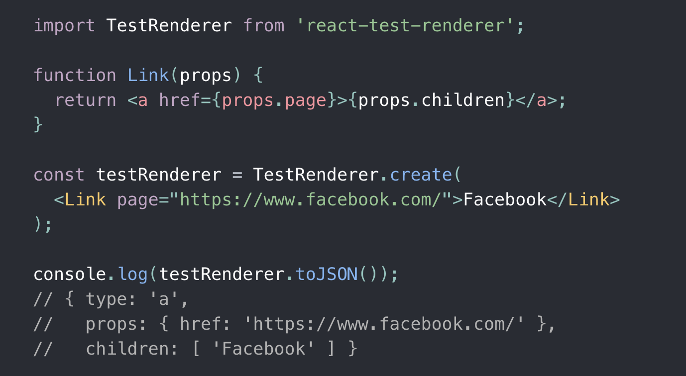

# React deep dive

## Rendering

- 렌더링은 Renderer라고 불리는 패키지에 의해서 처리된다.
- React는 단지 컴포넌트와 엘리먼트를 정의하고 비교 연산만을 담당한다.
- React는 플랫폼을 다루는 방법에 대해서는 아는 것이 없다.
- Renderer가 재조정(Reconciliation) 작업을 시작한다. Reconciliation 작업이 엘리먼트 트리를 생성하고 삽입이 필요한 곳에 삽입한다.
- 리액트는 어떠한 렌더러와도 호환되고, 아무나 자신만의 렌더러를 만들 수 있다.

## react-test-renderer

host 환경이 준비될 필요없이 React 컴포넌트를 순수한 Javascript 객체로 렌더링하는데 사용할 수 있는 렌더러

## Custom renderer 목록

[https://github.com/chentsulin/awesome-react-renderer](https://github.com/chentsulin/awesome-react-renderer)

### cli를 위한 react renderer

[https://github.com/vadimdemedes/ink](https://github.com/vadimdemedes/ink)

# React DOM Renderer 만들기

[Building a Custom React Renderer | Sophie Alpert](https://www.youtube.com/watch?v=CGpMlWVcHok)

Hello World 앱의 ReactDOM Renderer를 대체해볼거에요.

ReactDOM을 주석처리하고

우리가 직접 만들 Renderer인 ReactDOMMini 파일을 만들어줍니다.

ReactDOM을 ReactDOMMini로 대체

Renderer의 구현에는 Reconciler가 필요해요.
Recoinciler에게는 React가 host 환경과 어떻게 소통할 수 있는지를 알려줘야 합니다.

ReactDOMMini render 함수 인자로는 렌더할 것과 루트가 들어가네요.

render 함수를 만들어줍니다.

Reconciler 설정도 우선 빈 값들로 채워볼게요.

ReactDOMMini의 render 함수에서는 Reconciler를 통해 container를 만들고, container에 렌더할 리액트 컴포넌트를 전달합니다.

> Reconciler에게 한번 명시적으로 업데이트하고 이후에는 내부적으로 업데이트되는 모습을 보면서 [콘웨이의 생명게임](https://ko.wikipedia.org/wiki/%EB%9D%BC%EC%9D%B4%ED%94%84_%EA%B2%8C%EC%9E%84)이 연상됨 (CSR 기준)
> 

이제 Reconciler가 전달받은 리액트 컴포넌트를 가지고 host 인스턴스를 생성하려고 할거에요. createInstance를 호출할텐데 어떻게 소통해야하는지 우리가 아직 아무것도 알려주지 않았죠. 어떤 값들이 넘어오는지 봅시다.

DOM api를 이용해서 element를 만들고 속성들을 설정하고 반환해줍시다.

그런데 사실 반환하는 값을 React에서 사용하는 건 아니에요. 오로지 이 Reconciler의 “Host와의 소통창구”에서만 쓰입니다. 그래서 필요하다면 임의의 아무값이나 추가해서 사용할 수도 있어요.

다음은 Text 인스턴스 생성입니다. 마찬가지로 DOM api를 사용할게요.

이 세가지는 자식을 추가하는 방법을 구현하는 곳입니다.

container, parent는 각각 호스트 인스턴스에요.
container는 처음 render 호출할때 전달했던 루트 노드죠.

다행히 DOM api에서 

