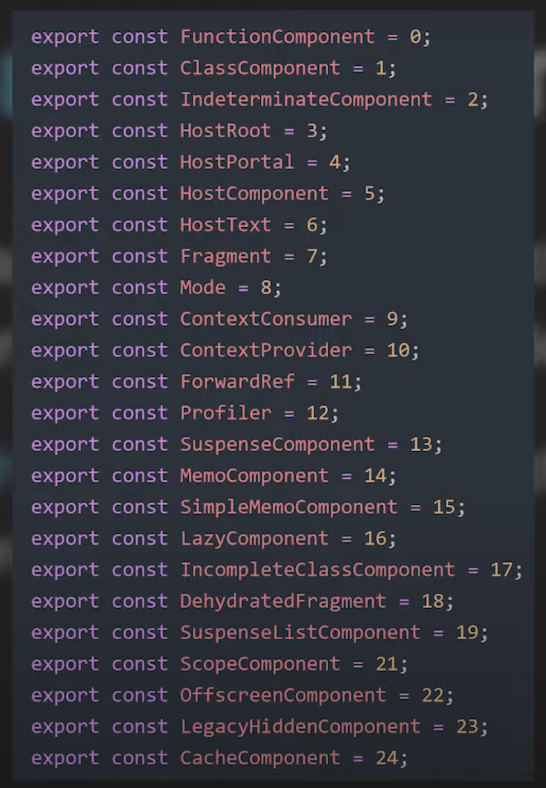
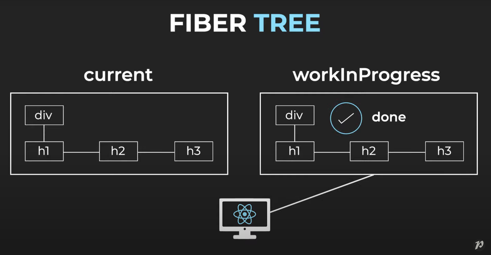
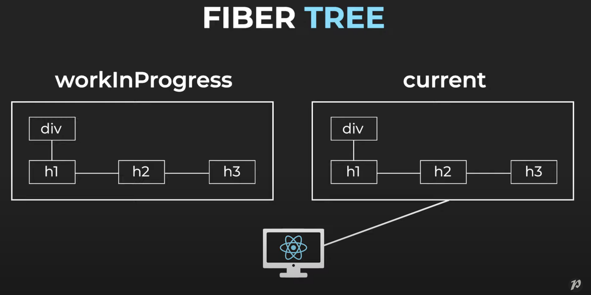
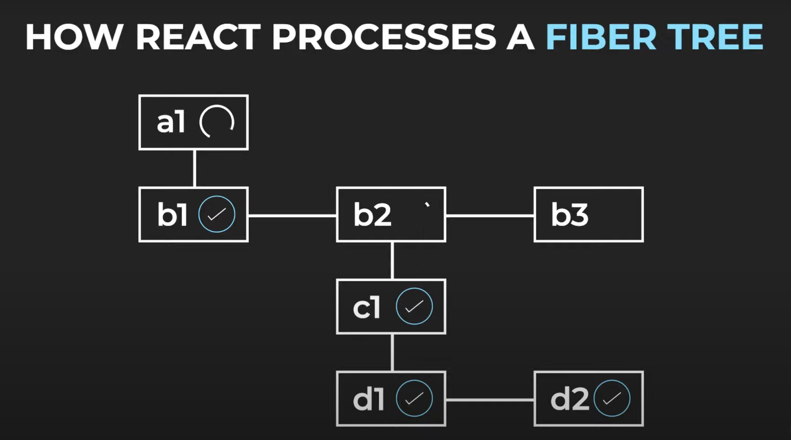

# #2 What Is React Fiber?

## 배경

- Stack Reconciler
    - Fiber 이전의 재조정자
    - 동기식
- 최적화에 좋은 브라우저 api 등장
    - requestIdleCallback: 유후 기간 동안 낮은 우선순위를 갖는 함수가 스케쥴링될 수 있도록
    - requestAnimationFrame: 다음 애니메이션 프레임에 높은 우선순위를 가지는 함수가 호출되도록
- **작업을 점증적인 단위로 분할** 필요성

## 작업 (Work)

- work는 무엇인가
    - 상태를 변경할 때마다
    - 라이프사이클 함수를 호출할 때마다
    - DOM 변경으로 이어지는 업데이트가 있을 때마다
- **work는 Fiber에 의존한다.**
- React가 Fiber를 처리할 때마다 작업을 직접 처리하거나 미래를 위해 예약한다.
- Time Slicing 기능
    - 작업을 청크로 분할하여 우선순위에 따라 일정을 잡을 수 있다.
    - requestAnimationFrame, requestIdleCallback api

## Render phase & Commit phase

- 렌더링 단계
    - 비동기 작업들을 수행
    - 작업의 우선순위를 정하고, 일부 작업은 일시 중지하거나 폐기
    - beginWork() 및 completeWork()와 같은 내부 함수가 호출
- 커밋 단계
    - commitWork() 함수 호출
    - 동기식, 중단될 수 없다.
    - 화면에 반영

## 그래서 Fiber가 무엇인가

아래 항목들 중 하나라도 할 수 있으려면, 우리는 작업을 유닛 단위로 나눌 수 있어야 한다. 

- 작업을 중단하고 나중에 다시 돌아올 수 있어야 한다.
- 다른 종류의 작업에 우선순위를 부여할 수 있어야 한다.
- 이전에 완료된 작업을 재사용할 수 있어야 한다.
- 더 이상 필요 없어지면 작업을 중단할 수 있어야 한다.

**Fiber는 작업(work) 단위를 나타낸다.**

또 다른 표현

- React component를 위한 스택의 재구현
- 하나의 fiber는 스택프레임에 해당
- 컴포넌트에 대한 입력과 출력에 대한 정보들을 가지고 있는 Javascript 객체
- React v16 이후 기본적으로 Fiber reconciler

## Fiber 속성

- Fiber는 리액트 컴포넌트 인스턴스, DOM node 등과 1:1 관계를 맺는다.

- Fiber 역시 리액트 Element처럼 식별할 수 있는 속성들을 가지고 있다.

- React는 몇가지 속성을 통해 Fiber 상태에 접근할 수 있다.

### Tag



### Type

- Fiber와 상응하는 컴포넌트 타입

### Key

- Fiber가 재사용될 수 있는지 판별하기 위해 재조정 중에 사용

## Fiber tree

### child

- 자식 fiber는 컴포넌트의 render 함수의 반환값에 해당

- Fiber Tree에는 자식은 하나만 있다. (첫번째 자식에 대한 참조)

```jsx
function Parent() {
  return <Child />;
}
```

### sibling

- 나머지 자식들은 첫번째 자식의 형제로 참조한다.

```jsx
function Parent() {
  return [<Child1 />, <Child2 />];
}
```

### return

- return은 부모에 대한 참조

## Fiber Trees (current, workInProgress)





- current 트리와 workInProgress 트리 두가지가 존재한다.
- workInProgress 트리의 변경이 끝나면 포인터를 교체, current 트리와 스왑한다.
- 이전 current 트리는 다시 workInProgress 트리가 된다.

## How React processes a Fiber tree



- beginWork(), completeWork()
- child가 없는 Fiber에 도달할 때까지 계속 개입, 해당 Fiber 완료 후 상위 Fiber를 완료하기 시작한다.
- React가 최종 Fiber(루트 Fiber라고도 함)를 완료한 후 commitWork()가 호출되고 Effect가 적용되고 변경 사항이 DOM에 플러시된다.

---

### 함께 읽으면 좋을 아티클

- [https://velog.io/@superlipbalm/blogged-answers-a-mostly-complete-guide-to-react-rendering-behavior](https://velog.io/@superlipbalm/blogged-answers-a-mostly-complete-guide-to-react-rendering-behavior)
- [https://immigration9.github.io/react/2021/05/29/react-fiber-architecture.html](https://immigration9.github.io/react/2021/05/29/react-fiber-architecture.html)
- [https://projects.wojtekmaj.pl/react-lifecycle-methods-diagram/](https://projects.wojtekmaj.pl/react-lifecycle-methods-diagram/)